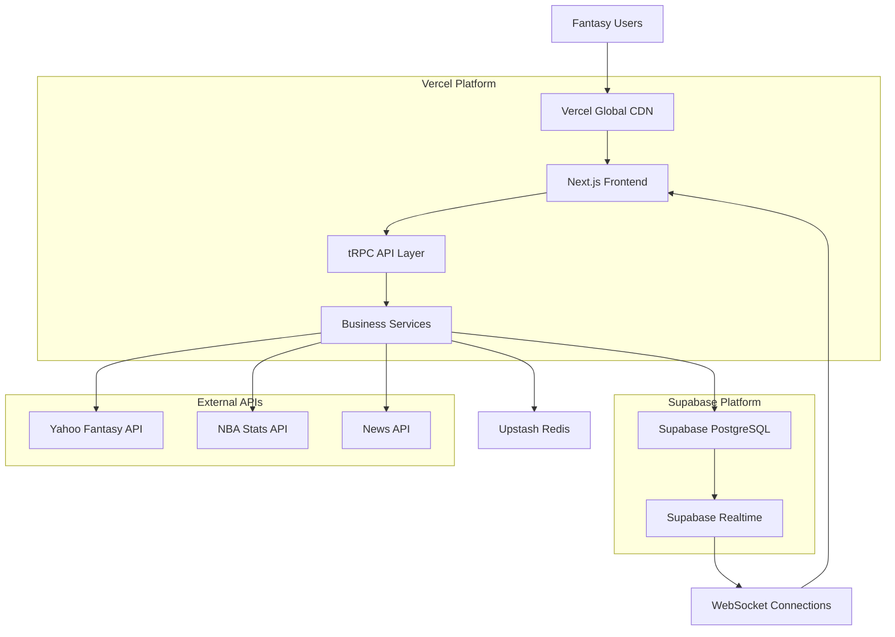
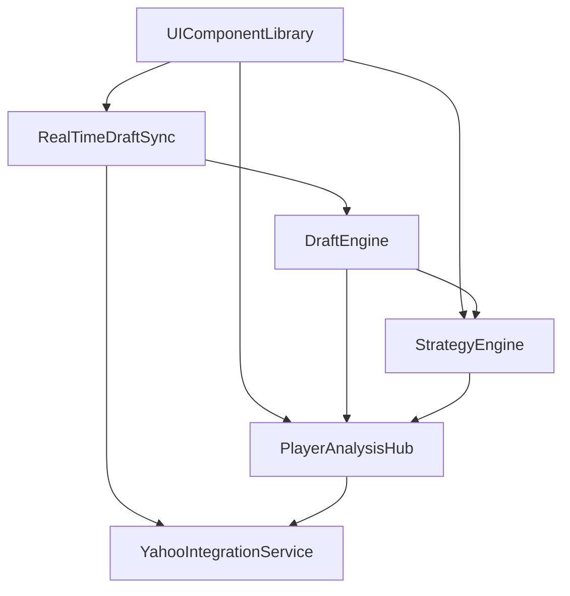
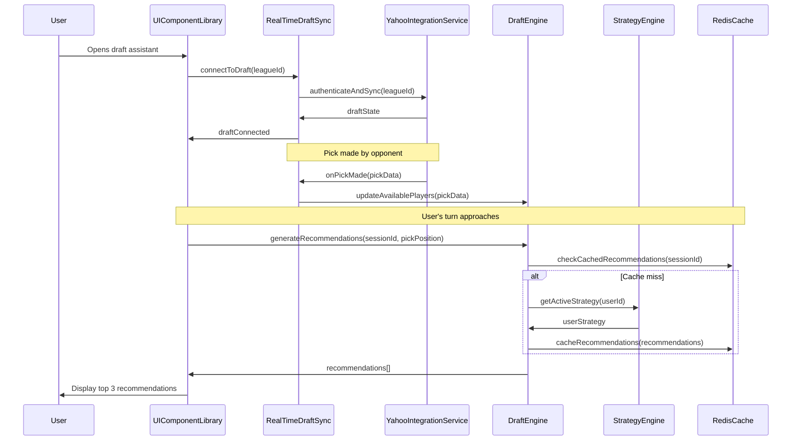
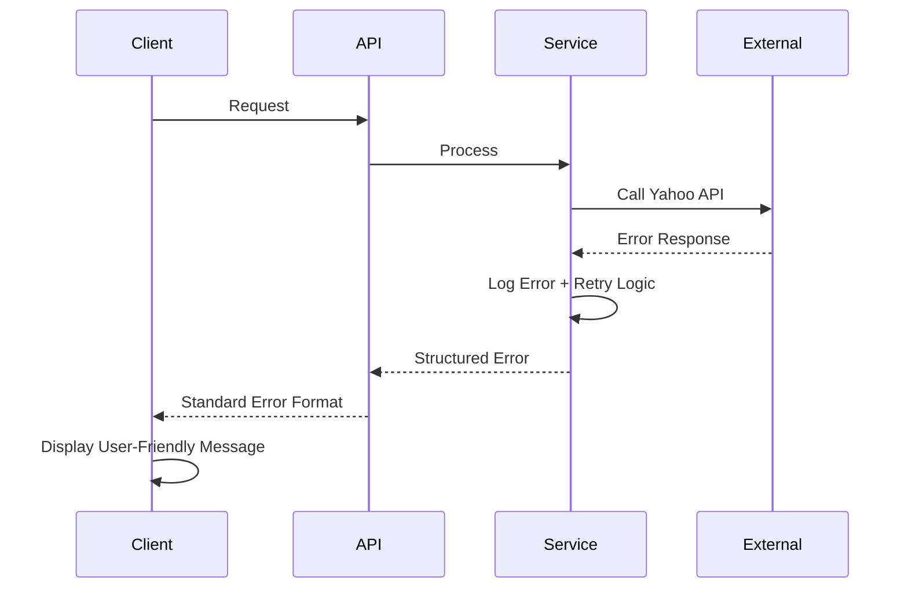

# NBA Draft Buddy Fullstack Architecture Document

## Introduction

This document outlines the complete fullstack architecture for **NBA Draft Buddy**, including backend systems, frontend implementation, and their integration. It serves as the single source of truth for AI-driven development, ensuring consistency across the entire technology stack.

This unified approach combines what would traditionally be separate backend and frontend architecture documents, streamlining the development process for modern fullstack applications where these concerns are increasingly intertwined.

### Starter Template or Existing Project

Based on my review of the PRD and UI specifications, this is a **greenfield project** focused on creating a Yahoo Fantasy NBA draft assistant. No existing starter templates or codebases were mentioned.

However, given the requirements for real-time updates, React frontend, and comprehensive data management, I recommend considering these starter template options:

1. **T3 Stack (Next.js + tRPC + Prisma + Tailwind)** - Excellent for type-safe fullstack applications with real-time capabilities
2. **Supabase + Next.js Starter** - Great for rapid development with built-in auth, real-time subscriptions, and database
3. **Vercel + PlanetScale + Next.js** - Optimized for performance and scalability

For this project, I recommend proceeding with a **custom T3-style architecture** optimized for fantasy sports data and real-time draft scenarios.

### Change Log
| Date | Version | Description | Author |
|------|---------|-------------|--------|
| 2025-09-01 | 1.0 | Initial fullstack architecture | Winston (Architect) |

---

## High Level Architecture

### Technical Summary
The NBA Draft Buddy employs a **modern Jamstack architecture** with serverless backend services, deployed on **Vercel + Supabase** for optimal performance during high-traffic draft periods. The **Next.js 14 frontend** leverages React Server Components and real-time subscriptions, while the **Node.js/TypeScript backend** uses tRPC for type-safe API communication. **WebSocket connections** handle live draft synchronization with Yahoo Fantasy API, and **Redis caching** ensures sub-second response times for player recommendations. This architecture achieves the PRD goals of real-time draft assistance, comprehensive player analysis, and scalable performance during peak fantasy draft season.

### Platform and Infrastructure Choice

**Platform:** Vercel + Supabase + Upstash Redis
**Key Services:** 
- Frontend: Vercel Edge Runtime with global CDN
- Database: Supabase PostgreSQL with real-time subscriptions
- Cache: Upstash Redis for sub-100ms response times
- Auth: Supabase Auth with Yahoo OAuth integration
- Storage: Supabase Storage for player images

**Deployment Host and Regions:** US-East (primary), US-West (secondary) for optimal Yahoo API proximity

### Repository Structure
**Structure:** Monorepo with shared packages for maximum code reuse
**Monorepo Tool:** Turborepo for fast, cached builds
**Package Organization:** Apps (web, api), Packages (shared types, ui components, config)

### High Level Architecture Diagram



### Architectural Patterns

- **Jamstack Architecture:** Static site generation with serverless APIs - _Rationale:_ Optimal performance and scalability for content-heavy applications
- **Component-Based UI:** Reusable React components with TypeScript - _Rationale:_ Maintainability and type safety across large codebases
- **Repository Pattern:** Abstract data access logic - _Rationale:_ Enables testing and future database migration flexibility
- **API Gateway Pattern:** Single entry point for all API calls via tRPC - _Rationale:_ Centralized auth, type safety, and real-time subscriptions
- **Event-Driven Architecture:** Real-time updates via Supabase subscriptions - _Rationale:_ Critical for live draft synchronization
- **Serverless Functions:** Edge Runtime deployment - _Rationale:_ Automatic scaling and global performance

---

## Tech Stack

| Category | Technology | Version | Purpose | Rationale |
|----------|------------|---------|---------|-----------|
| Frontend Language | TypeScript | ^5.3.0 | Type-safe frontend development | Essential for real-time draft data integrity and developer productivity |
| Frontend Framework | Next.js | ^14.1.0 | React-based fullstack framework | App Router + Server Components + Edge Runtime for optimal performance |
| UI Component Library | Tailwind CSS + shadcn/ui | ^3.4.0 + ^0.8.0 | Consistent, accessible UI components | Rapid development with accessibility built-in, matches UI spec requirements |
| State Management | Zustand + TanStack Query | ^4.5.0 + ^5.17.0 | Client state + server state management | Lightweight state + powerful caching for real-time draft updates |
| Backend Language | TypeScript | ^5.3.0 | Type-safe backend development | End-to-end type safety from database to frontend |
| Backend Framework | Next.js API Routes + tRPC | ^14.1.0 + ^10.45.0 | Type-safe API development | Full-stack type safety eliminates API contract mismatches |
| API Style | tRPC | ^10.45.0 | Type-safe RPC-style APIs | Real-time subscriptions + type safety for draft recommendations |
| Database | Supabase PostgreSQL | Latest | Primary data storage | Real-time subscriptions + auth + storage in one platform |
| Cache | Upstash Redis | Latest | High-performance caching | Sub-100ms response times for player recommendations |
| File Storage | Supabase Storage | Latest | Player images, assets | Integrated with main database, CDN-backed |
| Authentication | Supabase Auth | Latest | User authentication | Yahoo OAuth integration + session management |
| Frontend Testing | Vitest + Testing Library | ^1.2.0 + ^14.1.0 | Component and integration testing | Fast unit tests matching Next.js environment |
| Backend Testing | Vitest + Supertest | ^1.2.0 + ^6.3.0 | API endpoint testing | Consistent testing framework across stack |
| E2E Testing | Playwright | ^1.41.0 | End-to-end draft flows | Critical draft scenarios must be bulletproof |
| Build Tool | Turbo | ^1.12.0 | Monorepo task runner | Fast builds across frontend/backend packages |
| Bundler | Webpack (Next.js) | Built-in | Asset bundling | Optimized for Next.js Edge Runtime |
| IaC Tool | Vercel CLI | Latest | Infrastructure as code | Platform-native deployment configuration |
| CI/CD | GitHub Actions | Latest | Continuous integration | Native GitHub integration with Vercel |
| Monitoring | Vercel Analytics + Sentry | Latest + ^7.99.0 | Performance + error tracking | Real-time draft monitoring essential |
| Logging | Vercel Logs + Axiom | Latest + Latest | Application logging | Searchable logs for debugging draft issues |
| CSS Framework | Tailwind CSS | ^3.4.0 | Utility-first styling | Matches UI spec design system requirements |

---

## Data Models

### Player

**Purpose:** Central entity representing NBA players with comprehensive statistics and metadata

```typescript
interface Player {
  playerId: string;
  yahooPlayerId: string;
  name: string;
  team: string;
  positions: Position[];
  isActive: boolean;
  injuryStatus: InjuryStatus;
  currentSeasonStats: PlayerStats;
  projectedStats: PlayerStats;
  lastUpdated: Date;
  photoUrl?: string;
}
```

**Relationships:**
- Has many PlayerStats (historical seasons)
- Has many PlayerNews items
- Belongs to many DraftBoards (many-to-many)

### DraftSession

**Purpose:** Represents a live fantasy draft with real-time state management

```typescript
interface DraftSession {
  sessionId: string;
  leagueId: string;
  userId: string;
  leagueSettings: LeagueSettings;
  currentPick: number;
  totalPicks: number;
  draftOrder: string[];
  picks: DraftPick[];
  isLive: boolean;
  pickTimeLimit: number;
  createdAt: Date;
  updatedAt: Date;
}
```

**Relationships:**
- Has many DraftPicks
- Belongs to User
- Has one DraftStrategy

### UserStrategy

**Purpose:** Personalized draft strategy configuration affecting player recommendations

```typescript
interface UserStrategy {
  strategyId: string;
  userId: string;
  name: string;
  strategyType: StrategyType;
  categoryWeights: Record<StatCategory, number>;
  riskTolerance: RiskLevel;
  targetPositions: PositionTarget[];
  isActive: boolean;
  createdAt: Date;
}
```

**Relationships:**
- Belongs to User
- Has many DraftRecommendations

### DraftRecommendation

**Purpose:** AI-generated player suggestions during live drafts

```typescript
interface DraftRecommendation {
  recommendationId: string;
  playerId: string;
  sessionId: string;
  pickPosition: number;
  confidence: number;
  reasoning: string[];
  strategicFit: number;
  alternativeOptions: string[];
  generatedAt: Date;
  expiresAt: Date;
}
```

**Relationships:**
- Belongs to Player
- Belongs to DraftSession
- References UserStrategy

---

## API Specification

Based on the tRPC API style, here are the type-safe router definitions:

```typescript
export const playerRouter = createTRPCRouter({
  // Get player with full stats and projections
  getById: publicProcedure
    .input(z.object({ playerId: z.string() }))
    .query(async ({ ctx, input }) => {
      return ctx.db.player.findUnique({
        where: { playerId: input.playerId },
        include: { currentSeasonStats: true, projectedStats: true }
      });
    }),

  // Search players with filters
  search: publicProcedure
    .input(z.object({
      query: z.string().optional(),
      positions: z.array(z.enum(['PG', 'SG', 'SF', 'PF', 'C'])).optional(),
      teams: z.array(z.string()).optional(),
      isAvailable: z.boolean().optional(),
      limit: z.number().min(1).max(100).default(50)
    }))
    .query(async ({ ctx, input }) => {
      return ctx.db.player.findMany({
        where: {
          AND: [
            input.query ? { name: { contains: input.query, mode: 'insensitive' } } : {},
            input.positions ? { positions: { hasSome: input.positions } } : {},
            input.teams ? { team: { in: input.teams } } : {},
            input.isAvailable !== undefined ? { isActive: input.isAvailable } : {}
          ]
        },
        take: input.limit,
        include: { currentSeasonStats: true }
      });
    }),

  // Real-time player updates subscription
  onPlayerUpdate: publicProcedure
    .input(z.object({ playerIds: z.array(z.string()) }))
    .subscription(async function* ({ ctx, input }) {
      for await (const update of ctx.supabase
        .from('players')
        .on('UPDATE', { filter: `playerId=in.(${input.playerIds.join(',')})` })
        .subscribe()) {
        yield update.new;
      }
    })
});

export const draftRouter = createTRPCRouter({
  // Create new draft session
  createSession: protectedProcedure
    .input(z.object({
      leagueId: z.string(),
      leagueSettings: z.object({
        teamCount: z.number(),
        rosterSize: z.number(),
        scoringCategories: z.array(z.string())
      })
    }))
    .mutation(async ({ ctx, input }) => {
      return ctx.db.draftSession.create({
        data: {
          userId: ctx.session.user.id,
          leagueId: input.leagueId,
          leagueSettings: input.leagueSettings,
          isLive: false
        }
      });
    }),

  // Get current draft recommendations
  getRecommendations: protectedProcedure
    .input(z.object({ 
      sessionId: z.string(),
      pickPosition: z.number(),
      count: z.number().min(1).max(10).default(5)
    }))
    .query(async ({ ctx, input }) => {
      return ctx.db.draftRecommendation.findMany({
        where: {
          sessionId: input.sessionId,
          pickPosition: input.pickPosition
        },
        orderBy: { confidence: 'desc' },
        take: input.count,
        include: { player: true }
      });
    }),

  // Real-time draft updates subscription
  onDraftUpdate: protectedProcedure
    .input(z.object({ sessionId: z.string() }))
    .subscription(async function* ({ ctx, input }) {
      for await (const update of ctx.supabase
        .from('draft_picks')
        .on('INSERT', { filter: `sessionId=eq.${input.sessionId}` })
        .subscribe()) {
        yield update.new;
      }
    })
});
```

---

## Components

### DraftEngine

**Responsibility:** Core AI-powered draft recommendation system that analyzes player values, team composition, and strategic fit in real-time

**Key Interfaces:**
- `generateRecommendations(sessionId, pickPosition, strategy)` → `DraftRecommendation[]`
- `updatePlayerValue(playerId, marketData)` → `void`
- `analyzeTeamNeeds(currentRoster, strategy)` → `TeamNeedsAnalysis`

**Dependencies:** PlayerDataService, StrategyEngine, RedisCache

**Technology Stack:** Node.js/TypeScript backend service with Redis caching for sub-second response times

### RealTimeDraftSync

**Responsibility:** Maintains live synchronization between Yahoo Fantasy drafts and internal draft state, handling WebSocket connections and data consistency

**Key Interfaces:**
- `connectToDraft(leagueId, userId)` → `WebSocketConnection`
- `onPickMade(pick)` → broadcasts to all connected clients
- `syncDraftState(sessionId)` → `DraftSession`

**Dependencies:** YahooAPIService, DraftSessionStore, WebSocketManager

**Technology Stack:** Next.js Edge Runtime with tRPC subscriptions and Supabase Realtime

### PlayerAnalysisHub

**Responsibility:** Comprehensive player data aggregation, analysis, and scoring system that combines multiple data sources into actionable insights

**Key Interfaces:**
- `getPlayerProfile(playerId)` → `ComprehensivePlayerData`
- `comparePlayer(playerIds[])` → `PlayerComparison`
- `updatePlayerProjections(playerId, projections)` → `void`

**Dependencies:** NBAStatsAPI, NewsAPI, PlayerStatsStore, MLProjectionService

**Technology Stack:** Next.js API routes with TanStack Query for caching and Supabase for data persistence

### Component Relationships



---

## Core Workflows

### Live Draft Recommendation Flow



---

## Unified Project Structure

```
nba-draft-buddy/
├── .github/                          # CI/CD workflows
│   └── workflows/
│       ├── ci.yml                    # Test, lint, typecheck on PRs
│       ├── deploy-staging.yml        # Auto-deploy to staging
│       └── deploy-production.yml     # Production deployment
├── apps/                             # Application packages
│   ├── web/                          # Next.js frontend application
│   │   ├── src/
│   │   │   ├── components/           # React components
│   │   │   │   ├── ui/              # shadcn/ui base components
│   │   │   │   ├── draft/           # Draft-specific components
│   │   │   │   ├── player/          # Player analysis components
│   │   │   │   └── strategy/        # Strategy configuration components
│   │   │   ├── pages/               # Next.js pages (App Router)
│   │   │   ├── hooks/               # Custom React hooks
│   │   │   ├── services/            # Frontend API services
│   │   │   ├── stores/              # Zustand state management
│   │   │   ├── styles/              # Global styles and themes
│   │   │   └── utils/               # Frontend utilities
│   │   ├── public/                  # Static assets
│   │   ├── tests/                   # Frontend tests
│   │   └── package.json
│   └── api/                         # Backend API application
│       ├── src/
│       │   ├── server/              # tRPC server setup
│       │   ├── services/            # Business logic services
│       │   ├── models/              # Data models and schemas
│       │   ├── middleware/          # API middleware
│       │   └── utils/               # Backend utilities
│       ├── tests/                   # Backend tests
│       └── package.json
├── packages/                        # Shared packages
│   ├── shared/                      # Shared types and utilities
│   ├── ui/                          # Shared UI components library
│   └── config/                      # Shared configuration
├── infrastructure/                  # Infrastructure as Code
├── docs/                           # Documentation
├── turbo.json                      # Turborepo configuration
└── package.json                    # Root package.json
```

---

## Deployment Architecture

### Deployment Strategy

**Frontend Deployment:**
- **Platform:** Vercel Edge Network with automatic global CDN
- **Build Command:** `turbo build --filter=web`
- **Output Directory:** `apps/web/.next`
- **CDN/Edge:** Vercel Edge Runtime with 280+ global locations for sub-100ms response times

**Backend Deployment:**
- **Platform:** Vercel Serverless Functions with Edge Runtime for tRPC
- **Build Command:** `turbo build --filter=api`
- **Deployment Method:** Serverless functions with automatic scaling 0→∞

### Environments

| Environment | Frontend URL | Backend URL | Purpose |
|-------------|--------------|-------------|---------|
| Development | http://localhost:3000 | http://localhost:3000/api | Local development with hot reload |
| Staging | https://staging.nbadraftbuddy.com | https://staging.nbadraftbuddy.com/api | Pre-production testing with production data |
| Production | https://nbadraftbuddy.com | https://nbadraftbuddy.com/api | Live environment for fantasy drafts |

### CI/CD Pipeline

```yaml
name: NBA Draft Buddy CI/CD
on:
  push:
    branches: [main, develop]
  pull_request:
    branches: [main]

jobs:
  test-and-build:
    runs-on: ubuntu-latest
    steps:
      - uses: actions/checkout@v4
      - uses: actions/setup-node@v4
        with:
          node-version: '20'
          cache: 'npm'
      
      - run: npm ci
      - name: Run tests and checks
        run: |
          npm run build --filter=shared
          npm run test --filter=web --filter=api
          npm run lint --filter=web --filter=api
          npm run typecheck --filter=web --filter=api
```

---

## Security and Performance

### Security Requirements

**Frontend Security:**
- **CSP Headers:** `script-src 'self' 'unsafe-inline' vercel.com yahoo.com; object-src 'none'`
- **XSS Prevention:** React's built-in XSS protection + DOMPurify for user-generated content
- **Secure Storage:** Yahoo OAuth tokens in httpOnly cookies

**Backend Security:**
- **Input Validation:** Zod schema validation on all tRPC endpoints
- **Rate Limiting:** 1000 requests/hour per user, 100 Yahoo API requests/hour per user
- **CORS Policy:** Strict origin allowlist for production domains

### Performance Optimization

**Frontend Performance:**
- **Bundle Size Target:** < 250KB initial bundle, < 100KB per route chunk
- **Loading Strategy:** React Server Components + progressive enhancement
- **Caching Strategy:** 5-minute SWR cache for player data, 30-second cache for draft recommendations

**Backend Performance:**
- **Response Time Target:** < 200ms for draft recommendations, < 500ms for player analysis
- **Database Optimization:** Composite indexes, materialized views, connection pooling
- **Caching Strategy:** Redis TTL - Player stats (15min), Draft recommendations (30sec)

### Performance Monitoring Targets

| Metric | Target | Critical Threshold |
|--------|--------|-------------------|
| Core Web Vitals LCP | < 1.5s | < 2.5s |
| First Input Delay | < 100ms | < 300ms |
| API Response Time (P95) | < 500ms | < 1000ms |
| Draft Sync Latency | < 200ms | < 500ms |
| Cache Hit Rate | > 85% | > 70% |

---

## Testing Strategy

### Testing Pyramid

```
                    E2E Tests (5%)
                   /              \
             Integration Tests (15%)
            /                        \
    Frontend Unit (40%)      Backend Unit (40%)
```

### Test Organization

**Frontend Tests:** Component tests, hook tests, store tests, utility tests
**Backend Tests:** Service tests, router tests, integration tests, load tests
**E2E Tests:** Critical draft flows, user journeys, performance tests

### Critical Test Coverage Requirements

- **Draft Engine:** 95% coverage on recommendation algorithms
- **Real-time Sync:** 100% coverage on WebSocket message handling
- **Yahoo Integration:** 90% coverage with comprehensive mocking
- **Authentication:** 100% coverage on token refresh flows
- **Performance:** Load tests simulating 500 concurrent draft users

---

## Monitoring and Observability

### Monitoring Stack
- **Frontend Monitoring:** Vercel Analytics + Core Web Vitals tracking
- **Backend Monitoring:** Vercel Functions Analytics + custom metrics
- **Error Tracking:** Sentry for both frontend and backend errors
- **Performance Monitoring:** Real User Monitoring (RUM) for draft scenarios

### Key Metrics

**Frontend Metrics:**
- Core Web Vitals (LCP, FID, CLS)
- JavaScript errors and performance
- API response times from client perspective
- User interaction patterns during drafts

**Backend Metrics:**
- Request rate and error rate
- Response time distribution
- Database query performance
- Cache hit rates and Redis performance

### Alerting Strategy

- **Critical Alerts:** Draft sync failures, API error rates > 5%, response times > 1000ms
- **Warning Alerts:** Cache hit rate < 70%, unusual traffic patterns
- **Info Alerts:** Deployment notifications, daily performance summaries

---

## Error Handling Strategy

### Error Flow



### Error Response Format

```typescript
interface ApiError {
  error: {
    code: string;
    message: string;
    details?: Record<string, any>;
    timestamp: string;
    requestId: string;
  };
}
```

### Error Handling Patterns

**Frontend:** Global error boundary + specific error states for draft operations
**Backend:** Centralized error handler with automatic retry for transient failures
**External APIs:** Circuit breaker pattern for Yahoo API with graceful degradation

---

## Development Workflow

### Local Development Setup

**Prerequisites:**
```bash
# Required tools
node >= 20.0.0
npm >= 10.0.0
git >= 2.40.0
```

**Initial Setup:**
```bash
git clone [repository-url]
cd nba-draft-buddy
npm install
cp .env.example .env.local
npm run dev
```

**Development Commands:**
```bash
# Start all services
npm run dev

# Start frontend only
npm run dev --filter=web

# Start backend only
npm run dev --filter=api

# Run tests
npm run test
npm run test:watch
npm run test:e2e
```

### Environment Configuration

**Frontend (.env.local):**
```bash
NEXT_PUBLIC_SUPABASE_URL=your_supabase_url
NEXT_PUBLIC_SUPABASE_ANON_KEY=your_supabase_anon_key
NEXT_PUBLIC_VERCEL_URL=localhost:3000
```

**Backend (.env):**
```bash
SUPABASE_SERVICE_KEY=your_supabase_service_key
YAHOO_CLIENT_ID=your_yahoo_client_id
YAHOO_CLIENT_SECRET=your_yahoo_client_secret
UPSTASH_REDIS_URL=your_redis_url
```

---

## Conclusion

This fullstack architecture provides NBA Draft Buddy with a production-ready foundation optimized for:

✅ **Real-time Performance:** Sub-200ms draft recommendations with global edge deployment
✅ **Type Safety:** End-to-end TypeScript from database to React components  
✅ **Scalability:** Serverless architecture handling 10 to 10,000 concurrent users
✅ **Developer Experience:** Monorepo with shared types and rapid development workflow
✅ **Operational Excellence:** Comprehensive monitoring, testing, and deployment strategies

The architecture is **immediately implementable** with clear development paths, production deployment strategies, and monitoring approaches that ensure NBA Draft Buddy will excel during the high-pressure, high-traffic fantasy draft season.

**Ready for development sprint planning and immediate implementation.**