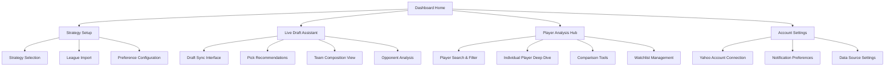
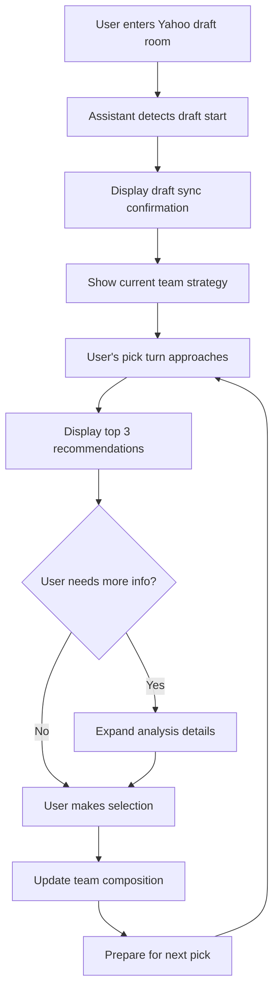
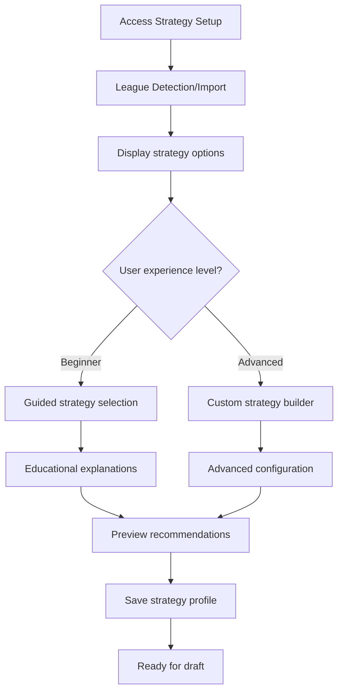

# Yahoo Fantasy NBA Draft Assistant UI/UX Specification

## Introduction

This document defines the user experience goals, information architecture, user flows, and visual design specifications for the Yahoo Fantasy NBA Draft Assistant's user interface. It serves as the foundation for visual design and frontend development, ensuring a cohesive and user-centered experience that makes sophisticated fantasy analysis accessible during high-pressure draft situations.

### Overall UX Goals & Principles

#### Target User Personas

**Primary Persona: Advanced Fantasy Analyst**
- 3+ years fantasy basketball experience with multiple leagues
- Seeks competitive advantage through data and strategy
- Comfortable with complex interfaces when value is clear
- Drafts primarily on desktop with multiple information sources
- Values speed and accuracy during live drafts

**Secondary Persona: Strategic Learner**
- 1-2 years fantasy experience, wants to improve
- Interested in understanding advanced concepts
- Needs guidance but doesn't want to feel patronized  
- May draft on mobile or tablet occasionally
- Values educational explanations alongside recommendations

#### Usability Goals

- **Decision speed**: Expert users can evaluate recommendations within 10 seconds during draft picks
- **Learning curve**: New users can understand strategy concepts through progressive disclosure without slowing expert workflows
- **Reliability**: Interface remains responsive and accurate during peak draft traffic (100+ concurrent users)
- **Context switching**: Seamless transitions between different analysis depths and draft phases

#### Design Principles

1. **Data density with clarity** - Present comprehensive analysis without visual overwhelm through smart layering and hierarchy
2. **Speed over aesthetics** - Prioritize fast decision-making during time-sensitive draft moments  
3. **Progressive expertise** - Surface beginner-friendly guidance without hampering advanced user workflows
4. **Trust through transparency** - Show underlying data factors so users understand recommendation reasoning
5. **Responsive reliability** - Maintain functionality across devices while optimizing for desktop draft scenarios

### Change Log
| Date | Version | Description | Author |
|------|---------|-------------|--------|
| 2025-01-09 | 1.0 | Initial UI/UX specification | Sally (UX Expert) |

## Information Architecture (IA)

### Site Map / Screen Inventory

### Navigation Structure

**Primary Navigation:** Persistent top navigation with 4 core sections (Dashboard, Draft Assistant, Player Analysis, Settings)

**Secondary Navigation:** Context-sensitive sidebar within each section showing relevant sub-features and filters

**Breadcrumb Strategy:** Minimal breadcrumbs only in deep analysis flows; most workflows are modal or single-level

## User Flows

### Critical Draft Flow: Live Draft Assistance

**User Goal:** Receive intelligent pick recommendations during live Yahoo Fantasy draft

**Entry Points:** Direct link from Yahoo draft room, dashboard "Join Live Draft" button, mobile notification

**Success Criteria:** User makes confident pick decision within draft time limit with clear understanding of strategic rationale

#### Flow Diagram

#### Edge Cases & Error Handling

- **Draft sync failure**: Manual draft entry mode with pick-by-pick updates
- **API rate limiting**: Cached recommendations with staleness indicators  
- **Slow connection**: Progressive loading with core recommendations prioritized
- **Multiple browser tabs**: Clear warning about draft sync conflicts

**Notes:** Flow optimized for desktop secondary screen usage with mobile fallback for emergency access

### Strategy Configuration Flow

**User Goal:** Set up personalized team-building strategy before draft begins

**Entry Points:** Dashboard setup wizard, pre-draft checklist, strategy modification during draft

**Success Criteria:** User has configured strategy that matches their fantasy philosophy and league settings

#### Flow Diagram

## Wireframes & Mockups

**Primary Design Files:** Figma workspace - [Design files will be created based on this specification]

### Key Screen Layouts

#### Live Draft Assistant Interface

**Purpose:** Primary draft companion showing real-time recommendations synchronized with Yahoo Fantasy draft

**Key Elements:**
- Draft status header (current pick, time remaining, user turn indicator)
- Top 3 player recommendations with confidence scores and brief rationale
- Team composition sidebar showing category balance and strategy alignment
- Quick access to player details without losing draft context

**Interaction Notes:** Designed for rapid scanning and decision-making; hover states reveal additional detail without requiring clicks

**Design File Reference:** [To be created - Main Draft Interface mockup]

#### Player Analysis Deep Dive

**Purpose:** Comprehensive player evaluation showing all data factors contributing to recommendations

**Key Elements:**
- Player header with photo, team, position, and key stats
- Multi-source analysis tabs (Traditional Stats, Podcast Insights, Social Sentiment, Practice Reports)
- Opportunity scoring with trend indicators
- Strategic fit analysis showing how player aligns with different team-building approaches

**Interaction Notes:** Progressive disclosure model - start with summary view, expand into detailed analysis sections

**Design File Reference:** [To be created - Player Analysis Detail view]

#### Strategy Configuration Dashboard  

**Purpose:** Setup interface for team-building approach selection and customization

**Key Elements:**
- Strategy overview cards with visual representations of approach (punt categories, balanced, etc.)
- Customization panel for category priorities and risk tolerance
- Preview section showing how strategy affects player valuations
- Educational tooltips explaining strategy implications

**Interaction Notes:** Guided flow for beginners with expert shortcuts for advanced users

**Design File Reference:** [To be created - Strategy Setup interface]

## Component Library / Design System

### Design System Approach

**Tailwind CSS + Custom Component Library** - Leverage Tailwind's utility classes for rapid development while building reusable components for fantasy-specific UI patterns

### Core Components

#### PlayerCard Component

**Purpose:** Consistent player representation across different contexts (recommendations, analysis, comparisons)

**Variants:** 
- Recommendation card (compact with key metrics)
- Analysis card (expanded with multiple data points)  
- Comparison card (side-by-side optimized)

**States:** Default, hover (shows additional info), selected, unavailable (already drafted)

**Usage Guidelines:** Include player photo, team logo, position, and context-appropriate metrics; maintain consistent layout for easy scanning

#### StrategyIndicator Component

**Purpose:** Visual representation of team-building strategy alignment and category balance

**Variants:**
- Compact indicator (dashboard overview)
- Detailed view (full category breakdown)
- Comparison mode (multiple strategies)

**States:** On-track (green), needs-attention (yellow), off-strategy (red), neutral (gray)

**Usage Guidelines:** Use consistent color coding and iconography; include tooltips for strategy explanations

#### DraftRecommendation Component

**Purpose:** Core recommendation display for live draft situations

**Variants:**
- Primary recommendation (featured prominently)
- Alternative options (secondary display)
- Fallback picks (when preferred targets unavailable)

**States:** High confidence, medium confidence, low confidence, strategic gamble

**Usage Guidelines:** Clear hierarchy showing confidence levels; quick access to reasoning without disrupting draft flow

## Branding & Style Guide

### Visual Identity

**Brand Guidelines:** Clean, analytical aesthetic emphasizing data credibility and strategic sophistication without intimidating casual users

### Color Palette

| Color Type | Hex Code | Usage |
|------------|----------|-------|
| Primary | #2563eb | Main brand elements, primary actions |
| Secondary | #7c3aed | Strategy indicators, advanced features |
| Accent | #f59e0b | Alerts, opportunities, value highlights |
| Success | #10b981 | Positive indicators, on-strategy confirmations |
| Warning | #f59e0b | Attention needed, scarcity warnings |
| Error | #ef4444 | Problems, off-strategy alerts |
| Neutral | #6b7280, #f3f4f6, #1f2937 | Text, backgrounds, borders |

### Typography

#### Font Families
- **Primary:** Inter (clean, highly legible for data displays)
- **Secondary:** JetBrains Mono (code/stats where monospace improves readability)
- **Display:** Inter (consistent brand experience)

#### Type Scale
| Element | Size | Weight | Line Height |
|---------|------|--------|-------------|
| H1 | 2.25rem | 700 | 1.2 |
| H2 | 1.875rem | 600 | 1.3 |
| H3 | 1.5rem | 600 | 1.4 |
| Body | 1rem | 400 | 1.6 |
| Small | 0.875rem | 400 | 1.5 |

### Iconography

**Icon Library:** Lucide React for consistent, clean iconography

**Usage Guidelines:** Use icons to support text, not replace it; maintain 24px standard size for primary actions; 16px for secondary/inline usage

### Spacing & Layout

**Grid System:** CSS Grid with Flexbox for component-level layouts

**Spacing Scale:** Tailwind's default scale (0.25rem base) with custom components defining internal spacing

## Accessibility Requirements

### Compliance Target

**Standard:** WCAG 2.1 AA compliance for all core functionality

### Key Requirements

**Visual:**
- Color contrast ratios: 4.5:1 for normal text, 3:1 for large text
- Focus indicators: Visible 2px outline on all interactive elements
- Text sizing: Supports browser zoom up to 200% without horizontal scrolling

**Interaction:**
- Keyboard navigation: All functionality accessible via keyboard with logical tab order
- Screen reader support: Semantic HTML with appropriate ARIA labels and landmarks
- Touch targets: Minimum 44px for mobile interactions

**Content:**
- Alternative text: Descriptive alt text for all informative images and charts
- Heading structure: Logical heading hierarchy (h1-h6) for screen reader navigation  
- Form labels: Explicit labels for all form inputs with error messaging

### Testing Strategy

**Automated Testing:** Integration with axe-core for continuous accessibility validation during development

**Manual Testing:** Keyboard navigation testing, screen reader testing with NVDA/JAWS, color blindness simulation

**Compliance Verification:** Quarterly accessibility audits during development phase

## Responsiveness Strategy

### Breakpoints

| Breakpoint | Min Width | Max Width | Target Devices |
|------------|-----------|-----------|----------------|
| Mobile | 320px | 767px | Phones, small tablets |
| Tablet | 768px | 1023px | Tablets, small laptops |
| Desktop | 1024px | 1439px | Standard laptops, desktops |
| Wide | 1440px | - | Large monitors, dual-screen setups |

### Adaptation Patterns

**Layout Changes:** Mobile stacks components vertically; tablet uses mixed layouts; desktop optimized for dual-screen draft scenarios

**Navigation Changes:** Mobile uses collapsible navigation; tablet shows persistent sidebar; desktop uses full navigation

**Content Priority:** Mobile shows only essential recommendations; tablet adds context; desktop shows full analysis capabilities  

**Interaction Changes:** Mobile uses swipe gestures for player navigation; desktop relies on hover states and click interactions

## Animation & Micro-interactions

### Motion Principles

**Purposeful Animation:** Motion serves functional purposes (state changes, loading, transitions) rather than decorative effects

**Performance First:** Animations optimized for 60fps performance; reduced motion settings respected

**Draft Context:** Minimal animation during active draft periods to avoid distraction; more liberal use during setup/analysis phases

### Key Animations

- **Draft Sync Connection:** Subtle pulse indicator showing live connection status (Duration: 2s, Easing: ease-in-out)
- **Recommendation Updates:** Smooth fade transition when new picks update recommendations (Duration: 300ms, Easing: ease-out)
- **Team Balance Changes:** Progressive fill animations for category balance charts (Duration: 500ms, Easing: ease-in-out)  
- **Alert Notifications:** Attention-drawing slide-in for scarcity warnings and opportunities (Duration: 400ms, Easing: ease-back)

## Performance Considerations

### Performance Goals

- **Page Load:** Initial load under 2 seconds on 3G connection
- **Interaction Response:** UI updates within 100ms of user action
- **Draft Sync:** Real-time updates with sub-500ms latency

### Design Strategies

**Progressive Loading:** Core draft functionality loads first; advanced analysis features load progressively

**Image Optimization:** Player photos and team logos served via CDN with appropriate sizing and compression

**Component Virtualization:** Large player lists use virtual scrolling to maintain performance

**State Management:** Efficient state updates minimize re-renders during rapid draft updates

## Next Steps

### Immediate Actions

1. **Create detailed visual mockups** in Figma based on wireframe specifications
2. **Establish component library** with Tailwind CSS and custom fantasy UI patterns
3. **Build responsive prototype** focusing on core draft assistant workflow
4. **Conduct user testing** with target persona fantasy players
5. **Iterate based on feedback** before full development implementation

### Design Handoff Checklist

- [ ] All user flows documented with edge case handling
- [ ] Component specifications complete with all variants and states
- [ ] Accessibility requirements defined with testing approach
- [ ] Responsive strategy clear with breakpoint behaviors
- [ ] Brand guidelines incorporated with consistent visual identity
- [ ] Performance goals established with optimization strategies

## Checklist Results

*UI/UX specification checklist will be executed by Product Owner to validate completeness and alignment with PRD requirements.*
